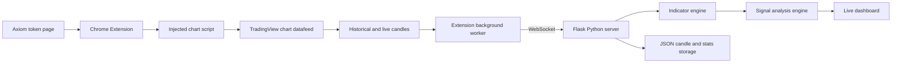
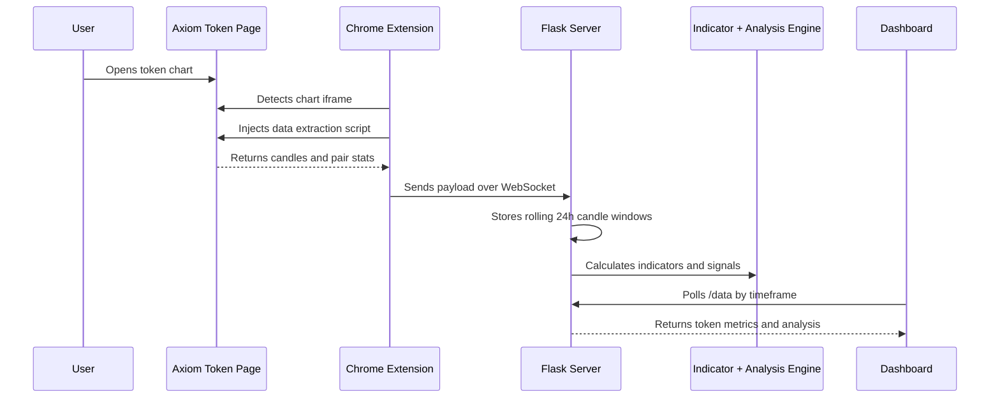
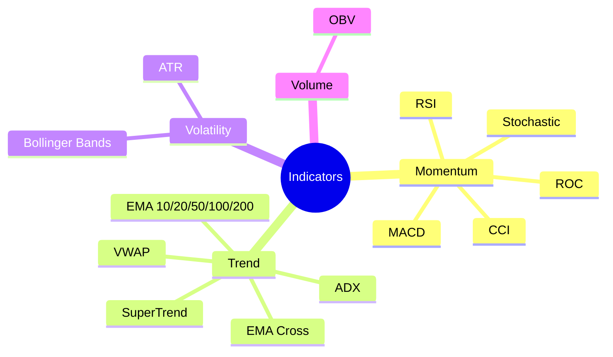
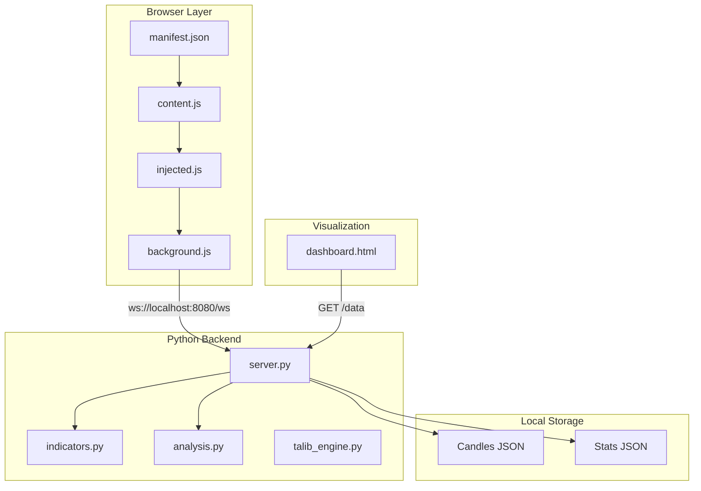
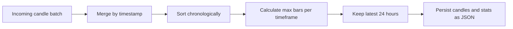

# Crypto Analysis Platform


A real-time crypto token analysis system that captures live chart data from Axiom, streams it into a Python backend, calculates technical indicators, detects market structure signals, and displays an updating dashboard for fast token evaluation.

This project combines browser automation, real-time data ingestion, backend engineering, technical analysis, and machine-learning preparation workflows into one end-to-end trading intelligence platform.

> Built as an engineering portfolio project to demonstrate practical full-stack problem solving, data pipeline design, and applied market analytics.

---

## What I Built

| Area | Work Completed |
|---|---|
| Browser Extension | Built a Manifest V3 Chrome extension that injects scripts into Axiom token pages and TradingView chart iframes. |
| Real-Time Streaming | Implemented a WebSocket pipeline from the browser extension to the Flask backend. |
| Data Engineering | Normalized candle data across multiple timeframes and retained rolling 24-hour windows. |
| Technical Analysis | Calculated RSI, MACD, EMA, VWAP, ADX, Bollinger Bands, OBV, ATR, SuperTrend, CCI, ROC, and EMA cross signals. |
| Market Structure | Added ChoCH detection, Fibonacci retracement/extension levels, and chart-pattern detection. |
| Dashboard | Created a live HTML dashboard that refreshes token metrics and signal summaries. |
| ML Preparation | Included notebooks for dataset preparation, cleaning, and model-training experimentation. |
| Deployment | Added Docker and Docker Compose support for reproducible local backend execution. |

---

## System Overview



The platform starts in the browser, extracts chart data directly from the active token page, streams it locally, analyzes it in Python, and displays the results in a recruiter-friendly dashboard.

---

## Why This Project Matters

This project shows more than a simple CRUD app. It demonstrates the ability to work with live, messy, high-frequency data and turn it into useful decisions.

| Engineering Skill | How It Shows Up |
|---|---|
| Full-stack systems thinking | Browser extension, backend server, data storage, and dashboard work together as one pipeline. |
| Real-time programming | WebSocket queueing and reconnect logic keep browser data flowing into the server. |
| Data normalization | Candle data is merged, sorted, de-duplicated, and trimmed by timeframe. |
| Algorithmic thinking | Custom signal logic combines trend, momentum, volatility, structure, and pattern analysis. |
| Product thinking | The dashboard is organized around how a trader would scan tokens quickly. |
| ML readiness | Raw market data is persisted so it can be cleaned and transformed into training datasets. |

---

## Data Flow



---

## Core Features

### Multi-Timeframe Candle Capture

The injected script requests candle history across several granularities:

| Timeframe | Purpose |
|---|---|
| `5S`, `15S`, `30S` | Short-term scalping and microstructure changes |
| `1`, `3`, `5` minutes | Fast intraday trend and momentum tracking |
| `15`, `30`, `60` minutes | Broader context and smoother trend signals |

The backend keeps a rolling 24-hour window per timeframe so the analysis stays fresh and memory usage remains controlled.

### Technical Indicator Engine

The Python backend computes a broad set of market indicators using `talipp`:



### Signal Analysis

The analysis layer converts raw indicator values into readable market context:

| Signal Type | Examples |
|---|---|
| Trend strength | Strong or weak trend based on ADX |
| Momentum | Bullish or bearish MACD crossover, RSI overbought/oversold |
| Volatility | Wide/tight Bollinger Bands and ATR-based volatility |
| Market structure | Bullish/Bearish ChoCH with volume confirmation |
| Fibonacci context | Nearby retracement and extension levels |
| Chart patterns | Double top/bottom, wedges, triangles, flags, pennants, cup and handle |
| Summary bias | Bullish, Bearish, or Neutral score |

---

## Architecture



---

## Project Structure

```text
crypto_platform/
├── docker-compose.yml
├── extension/
│   ├── manifest.json       # Chrome extension configuration
│   ├── background.js       # WebSocket connection, queueing, reconnects
│   ├── content.js          # Detects Axiom chart iframe and injects script
│   ├── injected.js         # Extracts candles and pair stats from chart context
│   ├── popup.html
│   └── popup.js
└── python_server/
    ├── server.py           # Flask routes, WebSocket receiver, persistence
    ├── indicators.py       # Technical indicator calculations
    ├── analysis.py         # Higher-level market signal analysis
    ├── talib_engine.py
    ├── templates/
    │   └── dashboard.html  # Live token dashboard
    ├── requirements.txt
    ├── Dockerfile
    ├── Data_clean.ipynb
    ├── Dataset_prep.ipynb
    └── Model_training.ipynb
```

---

## API and Runtime Interfaces

| Interface | Method | Purpose |
|---|---:|---|
| `/` | `GET` | Opens the live token dashboard. |
| `/data?tf=5S` | `GET` | Returns token prices, indicators, and analysis for a selected timeframe. |
| `/receive` | `POST` | Accepts candle payloads through HTTP. |
| `/ws` | WebSocket | Streams candle payloads from the extension to the backend. |

Example response shape from `/data`:

```json
{
  "TOKEN_ADDRESS": {
    "name": "TokenName",
    "open": 1.23,
    "high": 1.35,
    "low": 1.18,
    "close": 1.29,
    "volume": 123456,
    "rsi": 58.4,
    "macd_line": 0.02,
    "adx": 31.7,
    "analysis": {
      "overall": "Bullish",
      "trend_strength": "Strong",
      "momentum": "Bullish Momentum",
      "volatility": "High",
      "notes": []
    }
  }
}
```

---

## Getting Started

### 1. Run the Python Server Locally

```bash
cd python_server
python3 -m venv .venv
source .venv/bin/activate
pip install -r requirements.txt
python server.py
```

The server starts on:

```text
http://localhost:8000
```

If you want the extension's default WebSocket URL to work without changes, expose the backend on port `8080`:

```bash
PORT=8080 python server.py
```

### 2. Run with Docker Compose

```bash
docker compose up -d --build
docker compose exec python_server python server.py
```

Docker Compose maps:

```text
localhost:8080 -> container:8000
```

### 3. Load the Chrome Extension

1. Open Chrome.
2. Go to `chrome://extensions`.
3. Enable `Developer mode`.
4. Click `Load unpacked`.
5. Select the `extension/` folder.
6. Open an Axiom token page matching:

```text
https://axiom.trade/meme/*
```

### 4. Open the Dashboard

```text
http://localhost:8080
```

or, if running the Python server directly on its default port:

```text
http://localhost:8000
```

---

## Technical Highlights

### Rolling Window Storage

The backend keeps only the most recent 24 hours of candles per timeframe:



This keeps analysis responsive while preserving enough history for short-term trading signals and machine-learning dataset creation.

### WebSocket Reliability

The extension background worker includes:

| Feature | Benefit |
|---|---|
| Connection reuse | Avoids opening duplicate WebSocket connections. |
| Message queue | Captures payloads even if the server reconnects. |
| Auto reconnect | Restores streaming after backend restarts. |
| Background worker routing | Separates page extraction from transport logic. |

### Recruiter-Relevant Engineering Decisions

| Decision | Why It Matters |
|---|---|
| Manifest V3 extension | Uses current Chrome extension standards. |
| Local Flask server | Simple, inspectable, fast iteration for data-heavy experimentation. |
| WebSocket transport | Better fit for live chart updates than one-off HTTP requests. |
| Modular Python files | Separates server routing, indicators, and analysis logic. |
| Notebook workflow | Supports research, cleaning, and ML experimentation without mixing it into production code. |
| Docker support | Makes the backend easier to run consistently across machines. |

---

## Future Improvements

| Improvement | Impact |
|---|---|
| Add automated tests for analysis logic | Makes signal behavior safer to refactor. |
| Replace polling dashboard with WebSocket UI updates | Reduces latency and unnecessary requests. |
| Add persisted database storage | Enables longer historical backtesting. |
| Add model inference endpoint | Connects notebook training work to live predictions. |
| Add authentication/configuration | Makes the platform safer for multi-user or remote deployment. |
| Add screenshots or demo GIF | Makes the GitHub repo even more visually compelling. |

---

## Tech Stack

| Layer | Technology |
|---|---|
| Backend | Python, Flask, Flask-Sock |
| Analytics | NumPy, talipp |
| Frontend | HTML, CSS, JavaScript |
| Browser Extension | Chrome Extension Manifest V3 |
| Transport | WebSocket, JSON |
| Storage | Local JSON files |
| DevOps | Docker, Docker Compose |
| Research | Jupyter notebooks |

---

## Important Note

This project is for engineering, research, and educational purposes. It is not financial advice, and trading decisions should not be made from this software alone.

---

## Author

Built by Vamshi as a real-time crypto analytics and data engineering portfolio project.
