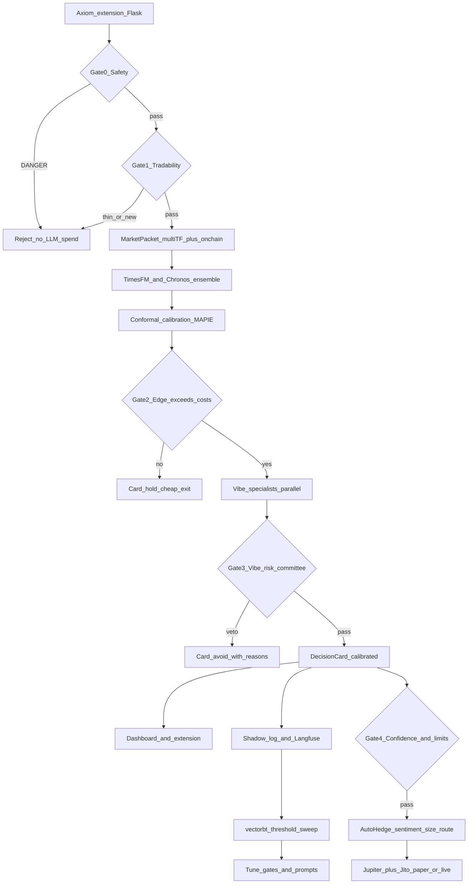

# Crypto Decision Platform — Best-Available Pipeline

## What changed in this revision

Research pass added five things the previous plan was missing, in order of impact:

1. **On-chain safety gate first.** For Axiom memecoins the dominant loss cause is rug / honeypot / whale dump, not a bad RSI read. Screening now runs **before** any forecast or LLM spend.
2. **Enriched context.** Axiom scraping alone lacks liquidity depth, holder concentration, pool age, deployer history. Add Helius + Birdeye + DexScreener.
3. **Forecast ensemble + calibrated confidence.** TimesFM alone is a single opinion with self-asserted uncertainty. Add Chronos-Bolt and calibrate intervals with **conformal prediction (MAPIE)** against our own logged errors.
4. **Guaranteed schemas + full observability.** DecisionCards enforced by `instructor` / `outlines`; every agent call traced/costed in **Langfuse**.
5. **Execution quality.** Solana fills are won or lost on slippage, priority fees and MEV — Jupiter dynamic slippage + Jito bundles + price-impact rejection.

---

## Locked decisions

1. Keep Axiom extension → Flask ingest + local indicators (data plane).
2. **No model training.** Pretrained inference + calibration only.
3. Venue: Solana memecoins.
4. **Cheap gates run before expensive ones.** Never pay LLM tokens on a token that fails safety.
5. **Vibe-Trading decides, AutoHedge executes.** No duplicated research.
6. Output = typed **DecisionCard**.
7. **Personal use only, zero-budget.** No paid product will be built or distributed. Free tiers only, a few tokens at a time.
8. **Deep Gemini review is reached through Antigravity CLI (`agy`)** — Gemini CLI is deprecated. Subscription Google Sign-In, or optional `GEMINI_API_KEY`.

---

## Cost and licensing (verified)

Personal, non-distributed use makes every component in this plan legally and financially free.

### Free and permissive — no conditions that affect us

| Component | License |
|---|---|
| Vibe-Trading | MIT |
| AutoHedge | MIT |
| TimesFM 2.5 | Apache-2.0 |
| Chronos / Chronos-Bolt | Apache-2.0 |
| MAPIE | BSD-3-Clause |
| instructor | MIT |
| outlines | Apache-2.0 |
| DuckDB | MIT |
| rugcheck-ai, solana-token-scanner | MIT |

### Free, with conditions that personal use satisfies

- **vectorbt** — Apache-2.0 **plus Commons Clause**: cannot sell a product whose value derives substantially from it. We are not selling anything, so this is fine. If that ever changes, swap to Nautilus Trader or Vibe's own backtest engine.
- **Langfuse** — MIT core; the `ee/` directories are separately licensed. Self-hosting the core is free with no event cap. Do not enable enterprise-only features.
- **Nautilus Trader** — LGPL-3.0. Fine as an unmodified library dependency.
- **FinceptTerminal** — AGPL-3.0. Already treated as a separate installed app, never vendored.
- **InvestLM** — research/noncommercial weights. Remains excluded on practical grounds anyway.

### Free tiers, sized for this workload

Because we evaluate only a handful of tokens at a time, free tiers are sufficient:

- **DexScreener** — keyless, ~300 rpm. Primary liquidity/pair source.
- **Helius** — 1M credits/month, 10 rps. Holders, authorities, RPC.
- **Birdeye** — 30K compute units/month, 1 rps. Optional cross-check; skip the WebSocket tier.
- **NVIDIA hosted Nemotron** — free for prototyping/research/learning (NVIDIA's own definition of trial use), roughly 40 requests/minute. That covers personal use; production deployment would require AI Enterprise, which we are not doing.
- **Gemini 3.1 Pro** — covered by the existing subscription, via CLI.
- **SolanaTracker / Exa** — optional. Only wire them if a free key is available; the pipeline degrades gracefully without bundler detection or news sentiment.

**Design consequence:** the system must treat every external service as *rate-limited and optional*. Each client needs a token-bucket limiter, a cache with the TTLs defined later, and a documented degraded mode. Gate ordering already minimizes calls.

### The only real money

Once `LIVE_TRADING=1`: Solana priority fees, Jito tips, swap fees and slippage. Paper mode costs nothing.

---

## LLM strategy under these constraints

Three tiers, cheapest first:

1. **Nemotron (hosted, free trial tier)** — default brain for Vibe and AutoHedge agents via the OpenAI-compatible endpoint `https://integrate.api.nvidia.com/v1`. Wrap in a limiter set just under 40 rpm with exponential-backoff retry.
2. **Ollama (local)** — offline fallback and the path for high-frequency structuring calls where rate limits would bite. `outlines` gives guaranteed schema compliance here with no retry cost.
3. **Antigravity CLI (`agy`)** — adversarial deep review, invoked deliberately rather than per decision. Replaces the deprecated Gemini CLI. See [Antigravity CLI](https://antigravity.google/product/antigravity-cli).

### Antigravity CLI integration (headless)

```bash
agy -p "<deep review prompt with MarketPacket JSON>" \
    --output-format json \
    --print-timeout 2m
```

- Headless / print mode: [docs](https://antigravity.google/docs/cli/headless/). Response text is in the JSON envelope's `response` field; diagnostics go to stderr.
- Optional `--json-schema` for structured output (`structured_output` in the envelope).
- Optional `--model <slug>` from `agy models`; leave unset for the account default.
- Unauthenticated headless runs exit with `authentication required` instead of hanging.

### Antigravity CLI runs *inside* the container (one-time login)

Native binary install (no Node). Persist `~/.gemini` so login survives rebuilds.

```dockerfile
RUN curl -fsSL https://antigravity.google/cli/install.sh | bash \
    && ln -sf /root/.local/bin/agy /usr/local/bin/agy
```

```yaml
volumes:
  - ./.gemini:/root/.gemini
environment:
  # Spoof SSH so login prints a URL instead of opening a missing browser
  SSH_CONNECTION: "172.17.0.1 22 172.17.0.2 22"
  SSH_CLIENT: "172.17.0.1 22 22"
  AGY_MODEL: ""   # or a slug from `agy models`
```

One-time login ([install & auth](https://antigravity.google/docs/cli/install/)):

```bash
docker compose exec python_server agy
# follow the printed URL on the host, paste the code back
# session lands under ./.gemini/antigravity-cli/
```

Optional API-key path for CI: set `modelProvider: gemini` in `.gemini/antigravity-cli/settings.json` and `GEMINI_API_KEY` in the environment.

Add `.gemini/` to `.gitignore`. Wrapper: `decision/agy_cli.py`. Preflight gates `mode=deep`.
## Tool responsibilities (no overlap)

| Layer | Tool | Unique job |
|---|---|---|
| Ingest | Extension + Flask | Live Axiom OHLCV/stats, multi-TF indicators |
| Safety | [rugcheck-ai](https://github.com/MrWizardlyLoaf/rugcheck-ai), [solana-token-scanner](https://github.com/0xdariel/solana-token-scanner) | Mint/freeze authority, Token-2022 traps, honeypot sell-sim, deployer |
| Enrichment | Helius (RPC/DAS), Birdeye, DexScreener | Holders, liquidity depth, pool age, security fields |
| Forecast | **TimesFM 2.5** + **Chronos-Bolt** | Two independent zero-shot quantile forecasts |
| Calibration | **MAPIE** (conformal) | Turn raw quantiles into *empirically covered* intervals |
| Research | **Vibe-Trading** | Parallel specialist swarm + shadow + tearsheets |
| Risk veto | **Vibe `risk_committee`** | Hard pass/fail + size ceiling |
| Schema | `instructor` (cloud) / `outlines` (local) | Structurally valid DecisionCard, no parse failures |
| Execution | **AutoHedge** + Jupiter + Jito | Sentiment, sizing, route, MEV-protected fill |
| Observability | **Langfuse** (self-host) | Traces, cost, latency, LLM-judge evals, prompt datasets |
| Replay | **vectorbt** (then Nautilus) | Sweep decision thresholds on logged history |
| LLMs | Nemotron free tier (default), Ollama (local fallback), Gemini 3.1 Pro **via CLI bridge** (adversarial) | Agent brains |
| Optional | Fincept app | Human desk UI (AGPL — never vendored) |
| Out | InvestLM | 2023 LLaMA-65B LoRA, noncommercial, equity-oriented |

---

## Pipeline: sequential gates, cheapest first



**Why gates matter:** a rug check costs ~1 RPC call; a Vibe swarm costs minutes and real tokens. Ordering them this way makes the system both cheaper and safer.

---

## Gate 0 — On-chain safety (new, highest impact)

Runs on the token mint as soon as the extension reports it.

Checks:
- **Authorities:** mint authority revoked? freeze authority revoked?
- **Token-2022 traps:** permanent delegate, transfer hook, non-transferable, pausable
- **Honeypot:** simulate a sell — can it actually be exited?
- **Liquidity:** pool size, LP status, pool age
- **Concentration:** top-10 %, Gini / HHI / Nakamoto coefficient
- **Deployer:** wallets with power, prior rug history
- **Bundler/sniper:** coordinated launch detection (SolanaTracker)

Output `SafetyReport{verdict: SAFE|CAUTION|DANGER, score 0-100, flags[]}`.

Rules:
- `DANGER` → immediate `avoid` card, **no forecast, no LLM**.
- `CAUTION` → continue but hard-cap position size and confidence.
- Cache: authorities 1h, holders 5–15m, liquidity 1–5m.

`rugcheck-ai` is an MCP server, so it can also be attached directly as a tool for Vibe/AutoHedge agents.

## Gate 1 — Tradability

Reject before spending on intelligence when:
- liquidity below floor, or our intended size exceeds a % of pool
- estimated round-trip slippage above threshold
- candle history too short for a forecast context
- price impact > 5%

## Gate 2 — Edge vs cost

After calibrated forecast: if `p50` expected move does not clear **fees + priority fee + tip + expected slippage** by a margin, return `hold` **without** running the swarm. This is the main token-cost saver.

## Gate 3 — Vibe risk committee veto

Bullish research alone cannot produce a buy. `risk_pass` required.

## Gate 4 — Portfolio limits

Daily loss cap, max concurrent positions, per-token cap, cooldown after consecutive losses, global kill switch.

---

## MarketPacket (enriched)

```json
{
  "token": {"mint": "...", "name": "...", "pool_age_min": 0},
  "as_of": "ISO-8601",
  "timeframes": {
    "1":  {"ohlcv_tail": [], "indicators": {}},
    "5":  {"ohlcv_tail": [], "indicators": {}},
    "15": {"ohlcv_tail": [], "indicators": {}},
    "60": {"ohlcv_tail": [], "indicators": {}}
  },
  "orderflow": {"buy_sell_ratio": null, "volume_acceleration": null, "net_volume_z": null},
  "onchain": {
    "safety": {"verdict": "SAFE", "score": 0, "flags": []},
    "liquidity_usd": 0,
    "top10_pct": 0,
    "holder_count": 0,
    "gini": 0,
    "nakamoto": 0,
    "deployer_flags": []
  },
  "market": {"price": 0, "spread_bps": 0, "est_slippage_bps": 0}
}
```

Sources: Axiom (candles/stats), Helius (holders/authorities), Birdeye (liquidity/security/OHLCV cross-check), DexScreener (free pair/liquidity spot check).

**Evidence rule:** agents may cite only packet values or tool results. Missing data is reported as unavailable, never estimated.

---

## Forecast layer: ensemble + real calibration

**Two independent zero-shot models:**

- **TimesFM 2.5** (200M, 16k context, quantile head) — `google/timesfm-2.5-200m-pytorch`
- **Chronos-Bolt** (205M, direct multi-step quantiles, up to 250x faster than original Chronos) — good latency partner

Optionally **Chronos-2** where volume should act as a covariate.

**Ensemble signal:** agreement between two architectures is genuine evidence; disagreement is a confidence penalty. This is strictly better than trusting one model's bands.

**Conformal calibration (MAPIE):** log forecast-vs-realized errors per timeframe and use `TimeSeriesRegressor` with **ACI / EnbPI** to produce intervals whose stated coverage matches observed coverage. Adaptive conformal inference widens bands after misses and tightens after hits — ideal for memecoin regime shifts.

Result: `expected_return_pct.p10/p50/p90` are **empirically calibrated**, not model-asserted. This is calibration on logged residuals, not model training.

---

## DecisionCard (final contract)

```json
{
  "token": {"mint": "...", "name": "..."},
  "horizon_bars": 10,
  "action": "buy | hold | avoid | reduce",
  "action_confidence": 0.0,
  "confidence_basis": "conformal_coverage + model_agreement + risk_score",
  "direction": "up | down | sideways",
  "expected_return_pct": {"p10": 0.0, "p50": 0.0, "p90": 0.0},
  "interval_coverage_target": 0.8,
  "cost_adjusted_edge_pct": 0.0,
  "price_targets": {"entry": null, "upside": null, "downside": null, "invalidation": null},
  "position": {"max_size_usd": 0, "size_basis": "kelly_fraction_capped_by_liquidity"},
  "safety": {"verdict": "SAFE|CAUTION|DANGER", "score": 0, "flags": []},
  "risk": {"risk_pass": true, "max_loss_pct": 0.0, "veto_reasons": []},
  "forecast_models": {"timesfm": {}, "chronos": {}, "agreement": 0.0},
  "drivers": [{"source": "safety|orderflow|timesfm|chronos|vibe_*", "claim": "...", "weight": 0.0}],
  "warnings": [],
  "meta": {"mode": "fast|full|deep", "gates_passed": [], "langfuse_trace_id": null, "latency_ms": 0}
}
```

Schema enforced with **Pydantic + instructor** (cloud, auto-retry on validation failure) and **outlines** for local models (constrained decoding, zero retries).

**Sizing:** fractional Kelly from calibrated distribution, then capped by volatility, liquidity share, and Gate 4 limits.

---

## Execution layer (AutoHedge + Jupiter + Jito)

AutoHedge is seeded with the finished DecisionCard — it does **not** redo chart research.

- **Sentiment agent** — unique pre-trade value (news/social pulse via Exa)
- **Risk agent** — final size, stop, take-profit
- **Execution agent** — venue route and order construction

Solana execution quality rules:

- Jupiter v6 quote/swap with `dynamicSlippage` and `dynamicComputeUnitLimit`
- Slippage: ~50 bps majors, **100–300 bps memecoins**
- Priority fee: sample `getRecentPrioritizationFees()` (75th percentile default, 90+ during congestion) — never hardcode
- **Jito bundle** when trade > ~0.5–5 SOL or pool is thin; tip = `tip_floor × ~1.5`, and tip must stay under ~0.1% of trade value
- Swap tx and tip tx must share the **same recent blockhash**
- Reject if price impact > 5%; split large orders
- Retry 2–3x

`LIVE_TRADING=0` default. Live requires explicit flag + kill switch + per-day loss cap.

---

## Performance and reliability architecture

- **Precompute on candle close**, not on request: indicators, forecasts and safety cached so `/decide` is mostly assembly.
- **Async workers + cache** with tiered TTLs (authorities 1h, holders 5–15m, liquidity 1–5m, forecast per bar). Use **Valkey** rather than Redis — same protocol, BSD-licensed, avoids Redis's newer source-available terms entirely.
- **Rate-limit discipline** on every external client: token bucket (Nemotron just under 40 rpm, Helius 10 rps, Birdeye 1 rps), exponential-backoff retry, and a hard per-minute budget so a runaway loop cannot burn a free tier.
- **Storage:** append candles/decisions to **Parquet + DuckDB** instead of growing JSON blobs (Vibe already depends on duckdb).
- **SSE progress** on `/decide?mode=full` so the UI streams gate results while the swarm runs.
- **Degraded modes, all explicit:** safety-only card → forecast-only card → full card; `deep` falls back to `full` when the Gemini bridge is unavailable; missing Birdeye/SolanaTracker fields are reported as unavailable rather than guessed.

---

## Observability and continuous improvement (no training)

- **Langfuse** (self-hosted, MIT): trace every gate, agent, and tool call with cost/latency; datasets for prompt regression; LLM-as-judge scoring of decision quality.
- **Shadow log** every card to `decisions.jsonl` + Vibe shadow account.
- **vectorbt** sweeps over logged cards: vary confidence floor, horizon, size rule → pick thresholds by risk-adjusted outcome. Promote to **Nautilus Trader** later for fill-accurate parity.
- Loop output = **updated gate thresholds and prompts**, never weight updates.

---

## API surface

| Endpoint | Behavior |
|---|---|
| `POST /safety` | Gate 0 only (instant, cheap) |
| `GET/POST /decide?mode=fast` | Gates 0–2 + ensemble + single Nemotron structuring |
| `GET/POST /decide?mode=full` | **Default:** + Vibe specialists ∥ + risk committee |
| `GET/POST /decide?mode=deep` | + Gemini 3.1 Pro adversarial review via in-container CLI, when signals conflict; falls back to `full` if unavailable |
| `POST /execute` | AutoHedge paper/live; refused unless Gates 3–4 pass |
| `GET /data` | Existing raw indicators (unchanged) |

---

## Code layout (glue only)

```text
python_server/
  decision/
    market_packet.py      # multi-TF + orderflow + onchain merge
    safety.py             # Gate 0 (rugcheck/scanner/Helius/Birdeye)
    forecast.py           # TimesFM + Chronos ensemble
    calibration.py        # MAPIE conformal from logged residuals
    gates.py              # Gates 1-4 incl. cost/edge and portfolio limits
    vibe_client.py        # presets, structured extraction
    autohedge_client.py   # DecisionCard-seeded execution
    llm.py                # Nemotron / Ollama providers + rate limiters
    agy_cli.py            # Antigravity CLI subprocess wrapper + preflight
    schema.py             # Pydantic DecisionCard (+instructor/outlines)
    fuse.py
  store/                  # parquet + duckdb
config/vibe/presets/
  axiom_memecoin_desk.yaml
```

Install: `timesfm[torch]`, `chronos-forecasting`, `mapie`, `instructor`, `outlines`, `langfuse`, `vectorbt`, `duckdb`, `valkey`, `vibe-trading-ai`, `autohedge`, `solana`/`solders`.

Env: `NVIDIA_KEY`, `HELIUS_API_KEY`, `OLLAMA_HOST`, `AGY_MODEL`, `GEMINI_API_KEY` (optional), `LIVE_TRADING=0`.

---

## Phased build

**Phase 0 — Clean break. DONE (2026-08-21).** `model_training/` moved to `_archive/ml/`. Extension, ingest, and indicators untouched. `xgboost`/`scikit-learn` dropped from requirements. Added `python_server/.dockerignore` — the build context was 3.2 GB of candle data and the image would not build without it. Secrets moved behind `.gitignore` with a committed `.env.example`.

**Phase 1 — Safety first. DONE (2026-08-21).** `python_server/decision/` implements Gate 0 end to end, ~0.5–1.0 s warm, all four sources free:

| Check | Source | Signal |
| --- | --- | --- |
| Mint / freeze authority, Token-2022 extensions, transfer fee | Solana RPC `getAccountInfo` | critical rug mechanisms |
| Holder concentration (top1/5/10, HHI) | Solana RPC `getTokenLargestAccounts` | insider dump risk |
| Liquidity, pool age, buy/sell imbalance | DexScreener | exit depth, honeypot shape |
| Sellability + price impact on a ~$20 exit | Jupiter quote | can the position actually be closed |

Exposed as `GET|POST /safety?mint=…` returning a `SafetyReport`, plus `/health` reporting per-tier readiness. Antigravity CLI (`agy`) is in the image; `/health` reports it installed and awaiting the one-time login.

Two correctness fixes found only by running it against live mints, both worth keeping in mind for later phases:
- DexScreener returns pools where the mint is on *either* side. Filtering to `baseToken.address == mint` is required or the report describes the counterparty token.
- The deepest pool is often dormant with all-zero transaction counts. Ranking pools by 24 h volume is what makes the buy/sell-imbalance check functional; exit depth is then the sum across all pools, since an aggregator routes across them.

A third issue surfaced from the test suite rather than live data: verdicts were purely additive, and a single high-severity flag is worth 25 points against a caution threshold of 30 — so an active freeze authority, or 65% insider concentration, reported as `safe`. Severity now gates independently of score: any critical flag forces `danger`, any high flag forces at least `caution`. Points still accumulate evidence, but one serious finding no longer needs a second to be heard.

**Phase 1.5 — Correctness and visibility. DONE (2026-08-21).**
- `tests/test_safety.py`: 28 hermetic offline tests (0.1 s) with all four sources patched. Both live-data bugs and the calibration flaw have named regression tests.
- `decision/store.py`: append-only daily JSONL log of every verdict, written at decision time. Built *before* the forecast layer deliberately — conformal calibration cannot invent its own history, and claiming an 80% interval covers 80% of outcomes requires a durable record of what was predicted and on what evidence. Readable directly via `read_json_auto('store/safety/*.jsonl')`.
- Dashboard has a Gate 0 column with verdict badge, exit depth, price impact, and top flags. Client-side 60 s TTL cache with in-flight de-duplication, because the table refreshes twice a second and the sources are rate limited; stale entries render dimmed rather than vanishing.

**Phase 1.6 — Helius wired, tuned against real memecoins. DONE (2026-08-21).** Holder concentration now runs: 20 accounts in ~130 ms. Testing against *actual* pump.fun tokens rather than BONK and USDC exposed three more issues, all from the same root cause — the earlier test tokens are mega-caps, the opposite of the venue:

- **Bonding curves report no liquidity.** DexScreener returns `liquidity: null` for `pumpfun` pairs, because a pre-graduation token trades against a curve, not a two-sided pool. Three actively-traded tokens were being flagged "liquidity not reported" and *still* returning `safe` at score 10 — missing data reading as a pass, the exact failure the design is meant to prevent. Exit-depth judgment now runs *after* the sell probe, so a routed sell at low impact substitutes for a depth figure. Only the case with neither depth nor a route is penalised, and that is high severity. `is_bonding_curve` is on the snapshot for the UI.
- **`getTokenLargestAccounts` refuses to rank past a few million holders.** That refusal is an *answer*: a holder base that wide cannot be concentrated. It is now an INFO flag with no penalty rather than a degradation, so USDC dropped from 75/degraded to 70/clean on that axis.
- **Helius reports index pressure as a JSON-RPC error with HTTP 200**, so the retry logic never saw it. Transient messages (`overloaded`, `try again`, `timed out`) now retry. The holder call also gets a 4 s budget against the global 12 s, since it is the slowest and least critical call and runs concurrently — it can degrade the verdict but must not dominate its latency.

Live results across venue types, 32 tests passing: three bonding-curve memecoins `safe` at score 0 with exit verified by route (1.9–2.5% impact on a $20 probe, non-pool concentration 4–26%); BONK `safe` at 0; USDC `danger` at 70 on its active mint and freeze authority.

Known limits, all acceptable:
- Source *failures* are not cached, so a persistently failing endpoint costs its retry budget on every call.
- Holder ranking on very large tokens can take ~3 s and occasionally times out against its 4 s budget. Capped, degrades gracefully, and irrelevant for new memecoins where the call returns in ~130 ms.
- Concentration is measured over token *accounts*, not owners. One entity holding through several accounts reads as several holders. Resolving owners costs an extra RPC call per account; revisit if it proves to matter.

**Candle corpus for testing. DONE (2026-08-21).** `decision/dataset.py` indexes the 68 Axiom-extracted files under `ML_Training_datasets/CandleData/Candles` (~4.4 GB). **OHLCV only** — the series are historical; addresses are stale (often pools) and must not be fed to Gate 0 or Jupiter. Offline tests validate schema, time-ordering, close-series extraction, forward-return labels, and that indicators still run on real candles. That is the offline input for Phase 2 forecast calibration.

**Phase 2 — Calibrated forecasting. DONE core (2026-08-21).** `/decide?mode=fast` runs Gates 1–2 + ensemble + conformal calibration. Corpus OHLCV is the offline input (`source=corpus`).

| Piece | Status |
| --- | --- |
| `MarketPacket` / `DecisionCard` | typed in `decision/schema.py` |
| Packet builder | live `token_data` or corpus files |
| Forecast ensemble | `stat` always; `chronos` / `timesfm` lazy if installed (`requirements-forecast.txt`) |
| Conformal residuals | `decision/calibrate.py` — fit on corpus, 360 residuals, empirical coverage ≈ 78–80% vs 80% target |
| Gate 1 tradability | history / liquidity / slippage / unsellable |
| Gate 2 edge | `p50 - round_trip_cost ≥ DECIDE_MIN_EDGE_PCT` (default 1.5%) |
| API | `GET/POST /decide?source=corpus&address=…&tf=1` and live when candles are in memory |
| Log | `store/decisions/*.jsonl` |

Torch backends are optional so the default image stays small. Install with `pip install -r requirements-forecast.txt` inside the container when you want Chronos-Bolt + TimesFM 2.5 in the ensemble.

**Phase 3 — Vibe intelligence. DONE (2026-08-21).** Heuristic specialist desk (`decision/vibe.py`) + risk committee Gate 3. `mode=full` always; `mode=deep` optionally calls Antigravity CLI and degrades if unavailable. Never upgrades avoid→buy.

**Phase 4 — AutoHedge paper execution. DONE (2026-08-21).** `decision/paper.py` + `/execute` + `/portfolio`. Paper fills only (`LIVE_TRADING` blocked). Target profit / stop / max-hold exits. Continuous swarm via `/swarm` (`decision/swarm.py`).

**Phase 5 — Feedback loop. DONE core (2026-08-21).** `decision/scoreboard.py` + `/scoreboard` logs realized vs predicted coverage/MAE. Paper closes feed outcomes. vectorbt/Nautilus left as later optional polish.

---

## Success criteria

1. Rug/honeypot tokens are rejected **before** any LLM cost.
2. Stated 80% intervals actually cover ~80% of realized moves (conformal check).
3. No `buy` without `risk_pass` and cost-adjusted edge.
4. Every decision has a Langfuse trace with cost and latency.
5. Paper fills modeled with realistic slippage/priority fee/tip.
6. Zero model training anywhere.
7. **Zero recurring spend:** no component exceeds a free tier, and no rate limit is breached under normal use.
8. `mode=deep` works through the in-container Antigravity CLI after a single login, and degrades cleanly when credentials are absent.

---

## Pipeline summary

**Safety gate → tradability gate → enriched multi-TF packet → TimesFM + Chronos ensemble → conformal calibration → edge-vs-cost gate → Vibe specialist swarm → risk veto → calibrated DecisionCard → UI/shadow/Langfuse → AutoHedge sizing + Jupiter/Jito execution → vectorbt/tearsheet feedback into gates.**
